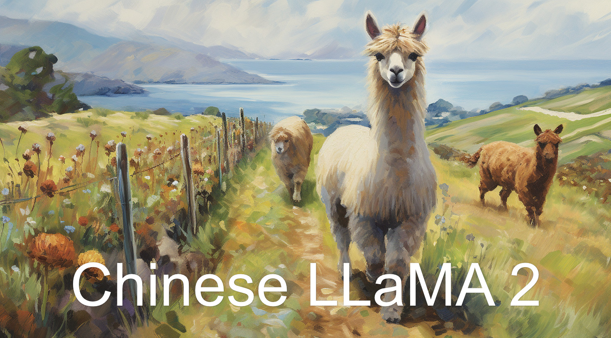

# Chinese Llama 2 7B 4bit


全部开源，完全可商用的**中文版 Llama2 模型及中英文 SFT 数据集**，输入格式严格遵循 *llama-2-chat* 格式，兼容适配所有针对原版 *llama-2-chat* 模型的优化。



## 基础演示


## 在线试玩

> Talk is cheap, Show you the Demo.

- [Demo 地址 / HuggingFace Spaces](https://huggingface.co/spaces/LinkSoul/Chinese-Llama-2-7b)
- [Colab 一键启动](#) // 正在准备

## 资源下载

- 模型下载：[Chinese Llama2 Chat Model](https://huggingface.co/LinkSoul/Chinese-Llama-2-7b)

- 4bit量化：[Chinese Llama2 4bit Chat Model](https://huggingface.co/LinkSoul/Chinese-Llama-2-7b-4bit)

> 我们使用了中英文 SFT 数据集，数据量 1000 万。

- 数据集：[https://huggingface.co/datasets/LinkSoul/instruction_merge_set](https://huggingface.co/datasets/LinkSoul/instruction_merge_set)

- 训练及推理代码：[https://github.com/LinkSoul-AI/Chinese-Llama-2-7b](https://github.com/LinkSoul-AI/Chinese-Llama-2-7b)

## 快速测试

```python
import torch
from transformers import AutoTokenizer, AutoModelForCausalLM, TextStreamer

# Original version
# model_path = "LinkSoul/Chinese-Llama-2-7b"
# 4 bit version
model_path = "LinkSoul/Chinese-Llama-2-7b-4bit"


tokenizer = AutoTokenizer.from_pretrained(model_path, use_fast=False)
if model_path.endswith("4bit"):
    model = AutoModelForCausalLM.from_pretrained(
            model_path,
            load_in_4bit=True,
            torch_dtype=torch.float16,
            device_map='auto'
        )
else:
    model = AutoModelForCausalLM.from_pretrained(model_path).half().cuda()
streamer = TextStreamer(tokenizer, skip_prompt=True, skip_special_tokens=True)

instruction = """[INST] <<SYS>>\nYou are a helpful, respectful and honest assistant. Always answer as helpfully as possible, while being safe.  Your answers should not include any harmful, unethical, racist, sexist, toxic, dangerous, or illegal content. Please ensure that your responses are socially unbiased and positive in nature.

            If a question does not make any sense, or is not factually coherent, explain why instead of answering something not correct. If you don't know the answer to a question, please don't share false information.\n<</SYS>>\n\n{} [/INST]"""

prompt = instruction.format("用英文回答，什么是夫妻肺片？")
generate_ids = model.generate(tokenizer(prompt, return_tensors='pt').input_ids.cuda(), max_new_tokens=4096, streamer=streamer)
```

## 相关项目

- [Llama2](https://ai.meta.com/llama/)

## 项目协议

[Apache-2.0 license](https://github.com/LinkSoul-AI/Chinese-Llama-2-7b/blob/main/LICENSE)

## 微信交流群

欢迎加入[微信群](.github/QRcode.jpg)
